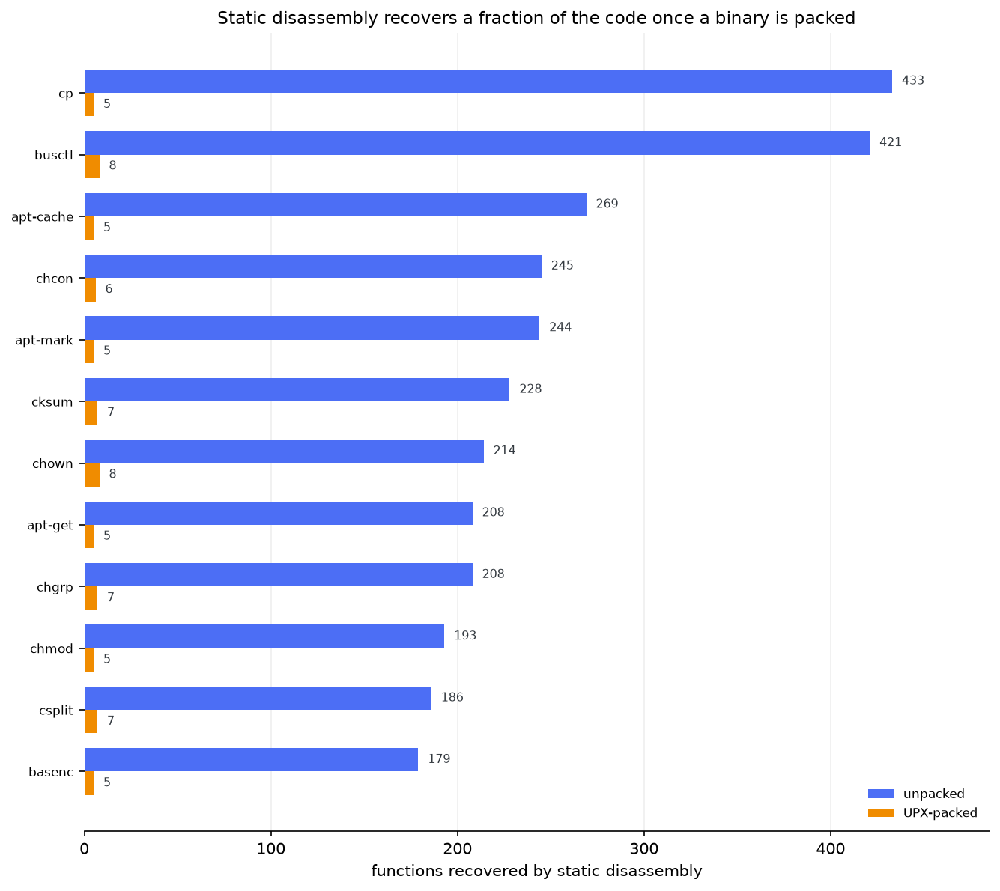
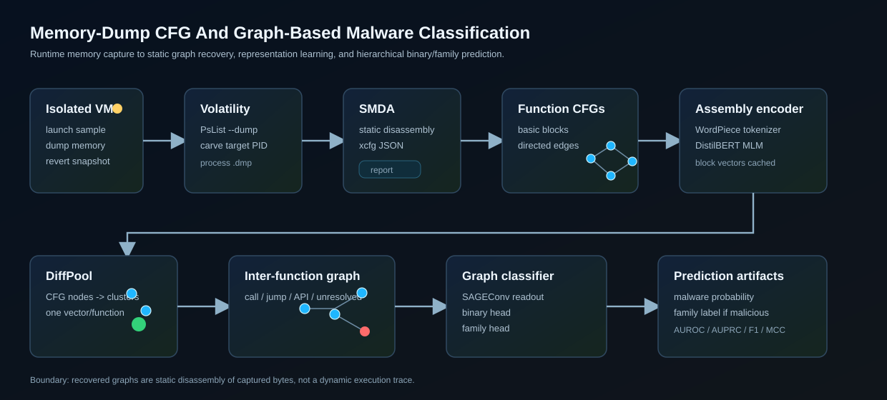
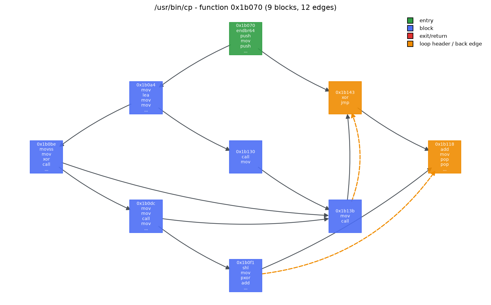
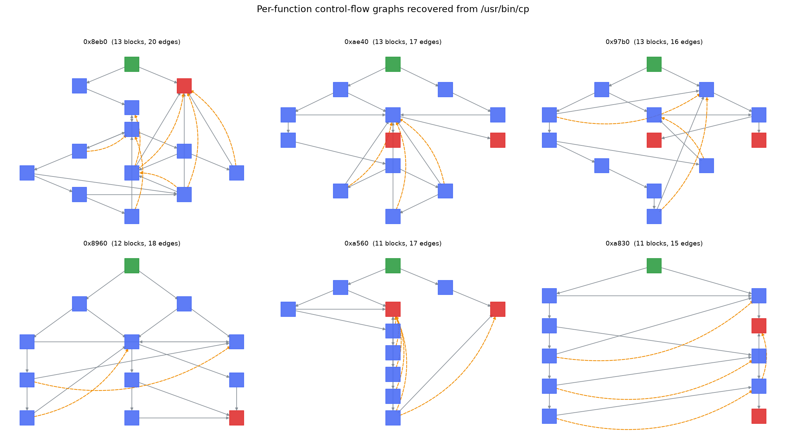
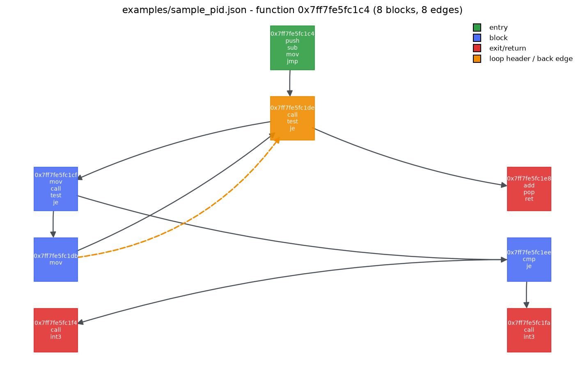
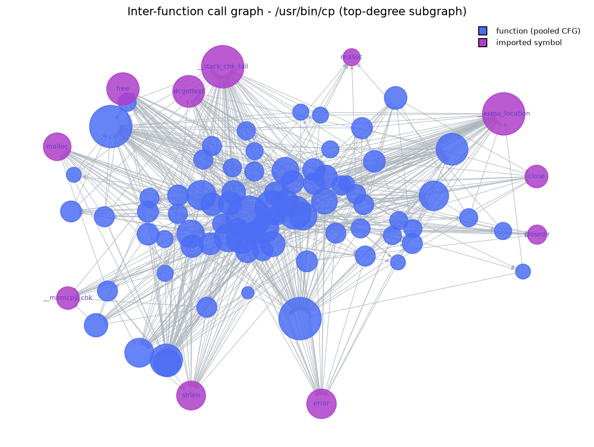

# MalGraph

CFG and GNN pipeline from memory-time disassembly.

[](https://www.python.org/)
[](https://pytorch.org/)
[](https://volatilityfoundation.org/)
[](LICENSE)

## Results

71 tests. Packing study on 32 system binaries: static disassembly of the UPX-packed file recovers 5.4% of the functions and 4.0% of the basic blocks recovered from the original. `/usr/bin/cp` falls from 433 functions to 5.

No classification number is reported. The labeled capture corpus is not published.



<sub>UPX packing study, 32 system binaries. 5.4% of functions and 4.0% of basic blocks remain after packing. Source: <code>docs/measurements/packing_stats.json</code>.</sub>

**Research artifact.** Not a published malware classifier.

## Quickstart

```bash
python -m venv .venv && source .venv/bin/activate
python -m pip install -r requirements.txt
python -m pip install -e .
pytest
python scripts/run_pipeline.py --out runs/current
```

With no `--reports`, `run_pipeline.py` falls back to the fixture generator so a
fresh checkout exercises the whole path — corpus, tokenizer, encoder, pooling,
classifier, evaluation, baselines, inference, figures — on a CPU in minutes.
Point it at real reports for an actual experiment.

## Data and models

Two things here cannot be published, and their absence is deliberate rather
than an omission:

- **The capture corpus.** Labeled memory dumps are taken from live malware
  running inside an isolated lab VM. Redistributing them means redistributing
  working malware, along with whatever host state a dump happened to contain.
- **The trained classifier.** A checkpoint fitted on that corpus is a derived
  artifact of it and carries the same constraints.

What *is* here is the complete pipeline, plus everything needed to verify it
against data you can obtain yourself:

- [`scripts/build_binary_corpus.py`](scripts/build_binary_corpus.py) builds real
  labeled corpora out of executables already installed on your machine, so the
  training and evaluation path can be reproduced end to end by anyone;
- [`examples/sample_pid.json`](examples/sample_pid.json) is a real SMDA report
  carved from a captured process, trimmed to a single function;
- [`src/memory_cfg/synth.py`](src/memory_cfg/synth.py) emits SMDA-shaped
  fixtures, which is what the integration tests run against.

Point the pipeline at your own reports and it trains on those instead; nothing
in the code is specific to any of the above. See
[Bring your own data](#bring-your-own-data).

## Core Idea



Runtime memory can expose unpacked, decrypted, relocated, or injected code that
the static file on disk hides. This project uses that captured code in a
hierarchical representation:

```text
instructions -> basic blocks -> function CFGs -> function embeddings
             -> inter-function graph -> binary/family prediction
```

SMDA provides a static disassembly of bytes present in the carved process image.
Recovered branches and calls are therefore *possible* control-flow
relationships, not proof that a branch executed during the capture window.

### Why capture memory at all

That premise is measurable, so this repository measures it.
`scripts/build_binary_corpus.py` compresses each binary with UPX — the packer
family malware has used for decades — and disassembles both copies. Across 32
system binaries, the packing figure above is the measurement. Static
disassembly of the packed file recovers **5.4% of the functions** and
**4.0% of the basic blocks** it recovers from the original. `/usr/bin/cp` falls
from 433 functions to 5. What survives is the unpacking stub; the real code
exists only once it has been unpacked into memory, which is exactly the moment
this pipeline takes its input from.

### Stage 1 — basic blocks and per-function CFGs

`CFG_Extractor` turns each `xcfg` entry into a directed `networkx` graph whose
nodes are basic blocks carrying their instruction lists. Below is a function
recovered from a real binary. Green is the entry block, orange marks loop
headers, and dashed orange arrows are the back edges that close the loops:



```bash
python -m memory_cfg.CFG_Extractor --report reports/some_report.json --stats --draw
```

One binary holds hundreds to thousands of these — `/usr/bin/cp` alone yields
433 functions over 4,601 basic blocks:



The same extractor on the committed capture fixture, which came out of a
process image rather than a file on disk:



### Stage 2 — instructions to vectors

Operands are canonicalized so ASLR-shifted equivalents share tokens: wide
hexadecimal becomes `ADDR`, smaller immediates become `IMM`, registers and
memory expressions are kept. Instructions within a block are joined by `[INS]`,
one block per corpus line. Imported symbols get their own `[API]` pseudo-blocks
so the encoder learns them in the same vocabulary.

A compact DistilBERT is trained as a masked language model over that corpus,
then frozen. `embed_blocks` masked-mean-pools its last hidden state into one
vector per basic block, cached by block hash — compiler boilerplate repeats
constantly across a corpus, so the cache pays for itself immediately.

### Stage 3 — CFG to function embedding

`DiffPool` pools each function's CFG into a single vector: one GNN embeds
nodes, a second predicts a soft assignment of blocks to clusters, and
link-prediction and entropy losses regularize that assignment.

### Stage 4 — the inter-function graph

`fcg` builds the call graph from `outrefs` and `apirefs`. `outrefs` are not all
calls — they mix direct calls, tail jumps, and unresolved indirect targets — so
edges are typed (`call`, `tail_jump`, `api`) rather than collapsed. Imported
symbols become their own nodes, pooled through the same head as functions so
every node in the graph shares one representation space.



`model.HierClassifier` runs a small GraphSAGE network over that graph and reads
it out with concatenated mean and max pooling, into a binary head and a family
head. Max pooling matters: the behaviour that decides a label usually lives in
a handful of functions, and a plain mean dilutes it away in a 4,000-function
binary.

## Status

The pipeline is implemented end to end and runs: capture parsing, CFG
construction, corpus building, tokenizer and encoder training, CFG pooling,
call-graph assembly, classifier training, evaluation, baselines, and
single-report inference. `pytest` exercises every stage, including the failure
modes that are easy to get wrong — zero-edge functions, blocks with no incident
edge, empty basic blocks, single-class splits, and checkpoint/encoder
mismatches.

**No classification performance is reported here.** Reporting one would require
publishing the labeled capture corpus and the checkpoint fitted to it, and
neither can be released. The remaining step is feeding a labeled corpus in;
everything upstream and downstream of that is in this repository.

What the repository does commit to is the discipline around any number that
does get produced. `train.py` writes four artifacts on every run — a config
with the seed and every hyperparameter, a split manifest naming each train and
test binary, a checkpoint, and per-sample predictions — and `eval.py` computes
metrics only from that saved prediction file, never from a live model. A number
without that artifact set is not reportable.

## Bring Your Own Data

Nothing in the pipeline depends on how a report was produced, only that it
follows SMDA's schema:

```bash
python -m memory_cfg.data_tokenizer --report-dir reports/ --out corpus.txt
python -m memory_cfg.tokenizer_train --corpus corpus.txt --out asm_tokenizer.json
python -m memory_cfg.transformer_train --corpus corpus.txt \
  --tokenizer asm_tokenizer.json --output-dir asm_encoder --epochs 3
python -m memory_cfg.train --reports reports/ --encoder asm_encoder/ \
  --labels reports/labels.json --out runs/experiment
python -m memory_cfg.eval runs/experiment/predictions.json --out runs/experiment/metrics.json
python -m memory_cfg.baselines --reports reports/ --split runs/experiment/split.json
```

`labels.json` is the only thing you must supply:

```json
{
  "Graph_PID6280_from_sample.json": {"is_malware": 1, "family": "Trojan"},
  "Graph_PID4100_from_benign.json":  {"is_malware": 0}
}
```

Or run every stage in one command:

```bash
python scripts/run_pipeline.py --reports reports/ --labels reports/labels.json \
  --out runs/experiment --epochs 30
```

## Repository Layout

```text
src/memory_cfg/        Python package
  SMDA_Loader.py       Volatility PsList --dump + SMDA disassembly to JSON
  CFG_Extractor.py     SMDA xcfg -> per-function networkx CFGs
  data_tokenizer.py    Canonical assembly block + API corpus writer
  tokenizer_train.py   WordPiece tokenizer training for assembly text
  transformer_train.py DistilBERT masked-LM pretraining for block embeddings
  embed_blocks.py      Frozen encoder -> cached basic-block vectors
  Graph_Loader.py      CFG + block vectors -> torch-geometric Data
  DiffPool.py          Function CFG pooling with DenseSAGE + diffpool
  fcg.py               Typed inter-function graph from outrefs/apirefs
  sample.py            Builds one hierarchical binary sample
  model.py             Binary and family classification heads
  Data_Loader.py       Spatial/temporal iteration over a report directory
  config.py            Experiment config + deterministic seeding
  train.py             Training, split manifest, checkpoint, predictions
  eval.py              AUROC/AUPRC/F1/MCC and family metrics from saved output
  predict.py           Single SMDA report -> prediction CLI
  baselines.py         Opcode n-gram and graph-stat logistic baselines
  synth.py             SMDA-shaped fixtures for the integration tests
  viz.py               CFG/FCG/metric figures (writes files, never blocks)
scripts/
  capture_memory.sh       Lab VM capture helper
  build_binary_corpus.py  Reproducible labeled corpora from local executables
  run_pipeline.py         Every stage in one command, with all artifacts
tests/                 71 tests covering each stage
examples/              Committed SMDA fixture
docs/assets/           Figures
docs/measurements/     Backing data for the packing measurement quoted above
legacy/                Historical experiments kept out of the active path
```

Dumps, carved images, large reports, corpora, encoder outputs, checkpoints, and
caches are gitignored.

## Reproducibility Contract

A performance number is reportable only if all four of these exist for it, and
every run writes all four:

| Artifact | Written by | Contents |
| --- | --- | --- |
| `config.json` | `config.ExperimentConfig.save` | seed and every hyperparameter |
| `split.json` | `train.save_split` | every train/test binary by name, with labels |
| `checkpoint.pt` | `train.save_checkpoint` | weights, families, encoder dimension |
| `predictions.json` | `train.predict_split` | the per-sample scores metrics come from |

`eval.py` never touches a model: hand it a `predictions.json` and it produces
the same table on any machine. `run_pipeline.py` additionally writes a
`run_summary.json` recording the git commit, the Python version, and the
checkpoint's sha256.

### What is and is not bit-reproducible

- **Reproducible.** Corpus construction, the split, and the metrics. `eval.py`
  on a given `predictions.json` returns the same table anywhere. A saved
  tokenizer + encoder + checkpoint replays predictions exactly;
  `tests/test_pipeline.py` asserts that round trip.
- **Not reproducible.** Retraining from scratch. WordPiece training resolves
  ties at the vocabulary cutoff through a randomly-seeded hash map inside
  `tokenizers`; it exposes no seed, and pinning thread counts does not help. Two
  runs over a byte-identical corpus learn same-sized vocabularies differing in a
  few hundred rare subwords, every downstream token id shifts, and the results
  move with it. Keep the tokenizer next to the checkpoint it was trained with.

## Full Workflow With Real Captures

### 1. Capture memory in an isolated lab

Review [`docs/lab_setup.md`](docs/lab_setup.md), then edit
`scripts/capture_memory.sh` for your guest VM name, IP, username, sample path,
and dump destination.

```bash
export VM_PASSWORD="..."
./scripts/capture_memory.sh
```

The script starts the sample in the guest, waits briefly, dumps whole-VM memory
with `virsh dump --memory-only`, and reverts the VM to the `clean_state`
snapshot. Keep the VM on an isolated network and treat every dump as sensitive.

### 2. Carve the process and disassemble it

This is the only stage needing the forensics stack, so it is not in
`requirements.txt`:

```bash
pip install "smda>=1.13" volatility3
python -m memory_cfg.SMDA_Loader --dump-dir /path/to/dumps \
  --dump-name sample_name --pid 6280
```

It runs Volatility's `windows.pslist.PsList --pid <pid> --dump`, selects the
carved `.dmp` for that PID, disassembles it with SMDA, and writes
`Graph_PID<pid>_from_<dump_name>.json`. Then follow
[Bring your own data](#bring-your-own-data).

### 3. Predict with a saved checkpoint

```bash
python -m memory_cfg.predict reports/Graph_PID6280_from_sample.json \
  --encoder asm_encoder/ --checkpoint runs/experiment/checkpoint.pt
```

`predict` refuses to run if the checkpoint's encoder dimension does not match
the loaded encoder, which prevents silent tokenizer/encoder mismatches.

## Limitations

- The graphs come from static disassembly of captured bytes, not a dynamic trace.
- Memory capture can reveal code absent from disk, but capture timing matters.
- The published corpora are system binaries. They establish that the pipeline
  works on real disassembly; they say nothing about detection rates on malware.
- Family-level conclusions about malware need a labeled multi-family capture
  corpus, GPU resources, and a family- and campaign-aware split strategy.
- No performance number should be reported without a saved config, split
  manifest, checkpoint, and evaluation artifact.

## Safety

Run unknown samples only inside an isolated VM and revert to a clean snapshot
after every capture. Do not commit raw dumps, carved regions, large SMDA
reports, model checkpoints, or experiment caches; the `.gitignore` is already
set up for those. `build_binary_corpus.py` only touches executables already
installed on the machine, and writes its packed copies to a scratch directory
it removes afterwards.

## License

[MIT](LICENSE). Volatility, SMDA, model dependencies, and any external datasets
retain their original terms.
